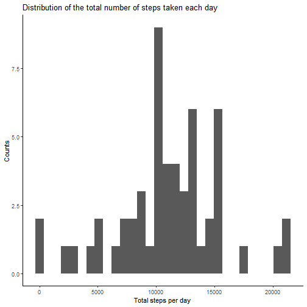
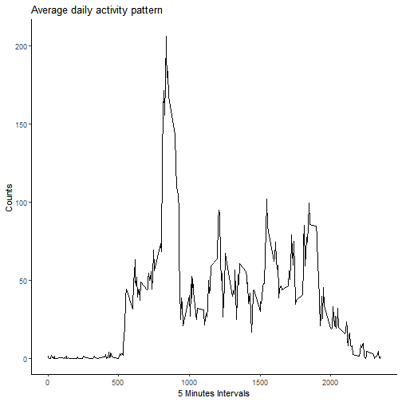
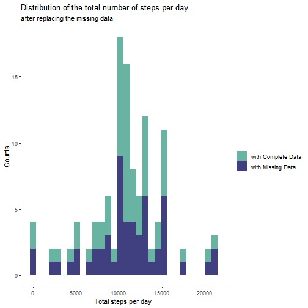
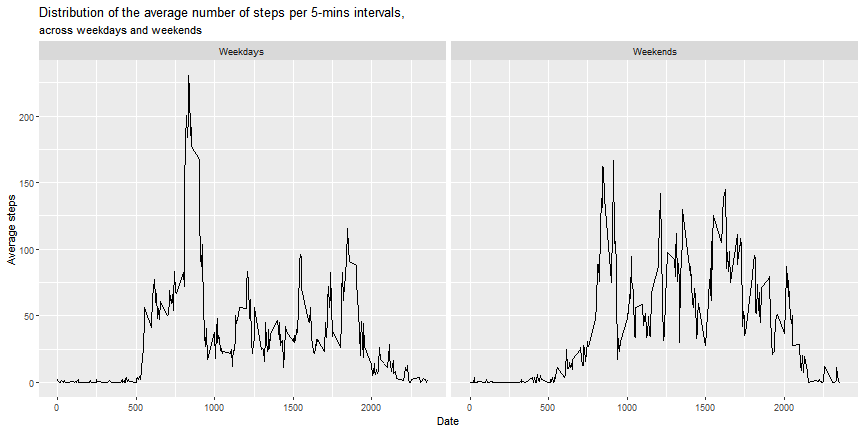

Activity Monitoring Analysis
==============================
*Project 1 of the course "Reproducible Research",
Data Science Specialization*

*Author: Francesco De Santis*


## Introduction

This project contains the analysis of the data obtained by a fitness wearable device.

## 1. Importing libraries and data

The following code is used for loading the libraries and the data.


```r
library(ggplot2)
library(dplyr)
library(tidyr)
library(xtable)
activityData <- read.csv("activity.csv", header=TRUE) %>% 
	tibble::as_tibble()
activityData$date<-as.Date(activityData$date)
```


## 2. Histogram of the total number of steps taken each day

We first calculate the number of steps taken each day.


```r
stepsPerDay <- select(activityData, steps, date,interval) %>%
	filter(!is.na(steps)) %>%
	group_by(date) %>%
	summarize(
		total_steps=sum(steps),
		mean_steps=mean(steps), 
		max_steps=max(steps), 
		max_interval=interval[steps==max_steps])
```

```
## `summarise()` regrouping output by 'date' (override with `.groups` argument)
```

Now we can draw an histogram of the total number of steps each day. 


```r
ggplot(stepsPerDay, aes(total_steps)) +
	geom_histogram(bins=30) +
	labs(x="Total steps per day", 
		y="Counts", 
		title="Distribution of the total number of steps taken each day") +
	theme_classic()
```



## 3. Mean and median number of steps taken each day


```r
meanSteps <- mean(stepsPerDay$total_steps)
medianSteps <- median(stepsPerDay$total_steps)
```

The typical values of the distribution are

- **mean**: 1.1034545 &times; 10<sup>4</sup>
- **median**: 11015


## 4. Average daily activity pattern

Now, let us have a look at the *average daily activity pattern*, i.e. the average number of steps taken in 5-mins intervals, across the day.


```r
averageStepsPerInterval <- select(activityData, steps, date,interval) %>%
			filter(!is.na(steps)) %>%
			group_by(interval) %>%
			summarize(average_steps=mean(steps))
```

```
## `summarise()` ungrouping output (override with `.groups` argument)
```

```r
ggplot(averageStepsPerInterval, aes(interval,average_steps)) +
	geom_line() +
	labs(
		x="5 Minutes Intervals", 
		y="Counts", 
		title="Average daily activity pattern") +
	theme_classic()
```



## 5. Maximum of the average daily activity pattern	

Let us consider the 5 mins interval with the maximum number of steps.


```r
averageMax <- filter(averageStepsPerInterval, average_steps==max(average_steps))
averageMax
```

```
## # A tibble: 1 x 2
##   interval average_steps
##      <int>         <dbl>
## 1      835          206.
```

The **interval corresponding to the maximum** is 835-840, with an average number of 206.1698113 steps.

## 6. Replacing Missing Data

The original data contains 2304 out of 17568 rows with missing data. In order to deal with missing data, we **replace the missing values with the corresponding value from the Average Daily Actvity pattern**.


```r
completeActivityData<-activityData
for(interval in unique(activityData$interval)){
	filt1=is.na(completeActivityData$steps) & 
		completeActivityData$interval==interval
	filt2=averageStepsPerInterval$interval==interval
	completeActivityData[filt1,]$steps =
		as.integer(averageStepsPerInterval[filt2,]$average_steps)
}
```

In the histogram below, we show how the replacement of missing data has affected the number of total steps measured every day.


```r
missingDb <- mutate(stepsPerDay, type="with Missing Data")
completeDb <- select(completeActivityData, steps, date,interval) %>%
	group_by(date) %>%
	summarize(total_steps=sum(steps)) %>%
	mutate(stepsPerDay, type="with Complete Data")
```

```
## `summarise()` ungrouping output (override with `.groups` argument)
```

```
## Error: Problem with `mutate()` input `..1`.
## x Input `..1` can't be recycled to size 61.
## i Input `..1` is `stepsPerDay`.
## i Input `..1` must be size 61 or 1, not 55.
```

```r
oldMean<- meanSteps
oldMedian <-medianSteps
newMean <- mean(completeDb$total_steps)
newMedian <- median(completeDb$total_steps)
ggplot(rbind(missingDb,completeDb), aes(x=total_steps, fill=type)) +
	geom_histogram(bins=30) +
	scale_fill_manual(values=c("#69b3a2", "#404080")) +
	labs(x="Total steps per day", 
		y="Counts", 
		title="Distribution of the total number of steps per day",
		subtitle="after replacing the missing data",
		fill="")+
	theme_classic()
```



The typical values have changed to

- **mean**: 1.074977 &times; 10<sup>4</sup>
- **median**: 10641

Replacing missing values with the interval averages resulted in a slightly decrease of the typical values. The effect is however minimal, as adding the missing values results in an even increase of the values within *all* the intervals, leaving the shape of the distribution the same. 
## 7. Average daily activity pattern in weekdays and weekends
We now differentiate the activity pattern measured during the week from the pattern measured during weekends.


```r
averageWeek <- select(completeActivityData, steps, date,interval) %>%
			mutate(weekday = ifelse(format(date, "%a") %in% c("sab","dom"),"Weekends","Weekdays")) %>% 
			group_by(weekday,interval) %>%
			summarize(average_steps=mean(steps))
```

```
## `summarise()` regrouping output by 'weekday' (override with `.groups` argument)
```

```r
ggplot(averageWeek, aes(interval, average_steps)) +
	geom_line() +
	facet_grid(.~weekday) + 
    	labs(x="Date", 
		y="Average steps", 
		title="Distribution of the average number of steps per 5-mins intervals,",
		subtitle ="across weekdays and weekends")
```



The plots show that while during the week the maximum of the activity pattern is in the morning, during the weekends the activity pattern is distributed more evenly along the day.
